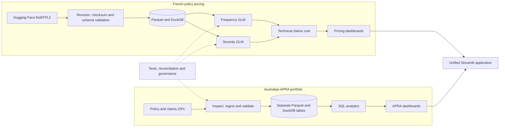
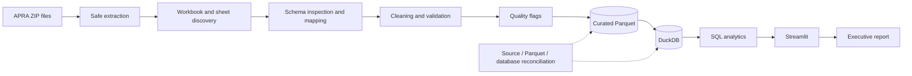
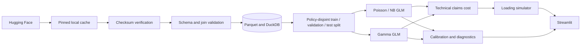

# Australian Insurance Portfolio Analytics and Pricing Workbench

[Live Streamlit application](https://australian-insurance-workbench.streamlit.app/) ·
[Architecture guide](docs/architecture.md) ·
[Verified project report](reports/project_completion_report.md)

A production-style insurance analytics portfolio project built for Australian pricing, data and
analytics roles. It combines two deliberately separate modules:

1. descriptive Australian portfolio analytics using APRA masked aggregate policy and claims reports;
2. educational policy-level frequency and severity modelling using the French freMTPL2 dataset.

> This project uses masked aggregate reports from APRA’s National Claims and Policies Database and
> the public French freMTPL2 motor-insurance dataset. It is an independent portfolio project and is
> not affiliated with, endorsed by or based on confidential data from APRA, IAG or any insurer.

## Public demo

**Live app:** [australian-insurance-workbench.streamlit.app](https://australian-insurance-workbench.streamlit.app/)

The repository includes compact, derived demo artifacts so the complete dashboard can run on
Streamlit Community Cloud without committing the raw archives or full processed datasets. The
hosted app uses those artifacts automatically; local development uses full processed data when it
is available.

The demo artifacts preserve the analytical measures used by the dashboard. French distribution
charts use deterministic samples, while the verified total policy, exposure and claim counts come
from the sanitized pipeline audit. See [`demo_data/README.md`](demo_data/README.md) and
[`demo_data/manifest.json`](demo_data/manifest.json) for the exact contents.

## Business problem

Insurance analysts need to understand portfolio mix, claim volume, severity, development and data
quality before making a pricing recommendation. This project demonstrates that workflow while
respecting the limits of each source. The APRA module answers descriptive Australian portfolio
questions. The freMTPL2 module demonstrates interpretable policy-level modelling. The datasets are
never merged and French model results are never represented as Australian market results.

## Verified delivery

- 720,030 aggregate APRA rows processed across eight overlapping, non-additive report cuts.
- 678,013 freMTPL2 frequency rows and 26,639 positive severity rows validated.
- 11 primary curated source tables plus model output tables in DuckDB.
- Policy-disjoint 60/20/20 modelling splits, with policy ID excluded from all formulas.
- 16 Streamlit pages, downloadable quality exceptions, 11 analytical SQL files and eight notebooks.
- Exact source-to-Parquet-to-DuckDB row reconciliation for all eight APRA tables.

The generated [APRA executive summary](reports/apra_executive_summary.md),
[French model summary](reports/french_model_summary.md), [completion report](reports/project_completion_report.md)
and [resume evidence](reports/resume_bullets.md) contain the current verified results.

## Why pricing and claims analytics matter

Claim count and claim severity are different risk processes. Exposure, premium and portfolio mix
also change over time, while financial movements can include recoveries or corrections. Reliable
pricing work therefore depends on traceable data, valid denominators, explicit assumptions and
reconciliation—not only a predictive model.

## Modules

### Australian APRA portfolio

The APRA pipeline safely extracts and inspects every workbook and worksheet, preserves raw value
snapshots, standardises schemas, adds source lineage, flags exceptions and writes one curated
Parquet/DuckDB table per report. State, occupation, excess and indemnity-limit reports are alternate
cuts of the same portfolio. The application always displays its selected report basis and never
adds alternate cuts together.

Supported measures include reported and finalised claims, claim payments, incurred movements,
weighted risk-in-force exposure and gross earned premium. Frequency, loss ratio and pure premium
are not presented as universal APRA KPIs because valid alignment depends on the selected aggregate
grain. The pricing page therefore uses a transparent claims-cost index rather than fictional dollar
premiums.

### French policy pricing

The French module downloads `mabilton/fremtpl2` from Hugging Face, records the repository commit,
file sizes, row counts and SHA-256 checksums, then caches the files locally. It validates exposure,
claim counts, schema and many-to-one policy joins. A Poisson GLM is the frequency baseline; material
overdispersion triggers a Negative Binomial challenger. A Gamma log-link GLM models strictly
positive severity. Technical claims cost is frequency multiplied by severity.

> French motor third-party liability data is used as an educational actuarial modelling dataset.
> Results are not directly representative of the Australian motor-insurance market.

## Data sources

- APRA National Claims and Policies Database masked December 2024 policy and claims reports,
  supplied locally as ZIP archives.
- [`mabilton/fremtpl2`](https://huggingface.co/datasets/mabilton/fremtpl2), revision
  `b645a3d34da6edf421785c83ddd39637b6553a10`.

Raw and downloaded data is ignored by Git. The project never substitutes synthetic data when a
real source is unavailable; disabling the French module leaves the APRA module operational.

## Architecture

The complete [architecture guide](docs/architecture.md) contains six diagrams covering system
context, both data pipelines, model flow, application runtime selection, repository components and
the public deployment. The key system view is below.



Full source: [architecture-overview.mmd](docs/architecture-overview.mmd).

## APRA data flow



Full source: [apra-data-flow.mmd](docs/apra-data-flow.mmd).

## French model flow



Full source: [french-model-pipeline.mmd](docs/french-model-pipeline.mmd).

## Repository structure

```text
app/                  Streamlit entry point, recruiter landing page and 15 analytical pages
data/                 Raw, external, interim and processed layers (ignored)
database/             Local DuckDB database (ignored)
docs/                 Architecture, methodology, data dictionary and limitations
notebooks/            Eight reproducible analytical entry points
reports/              Generated evidence-backed summaries
scripts/              Inspection, build, training, quality and report commands
sql/apra/             APRA analytical and quality SQL
sql/fremtpl2/         Frequency, severity, decile and monitoring SQL
src/apra/             Discovery, ingestion, validation, metrics and scenarios
src/fremtpl2/         Download, validation, preprocessing, GLMs and premium logic
src/database/         DuckDB loading and reconciliation
tests/                Synthetic unit and integration fixtures
```

## Data dictionary and KPI definitions

The detailed [data dictionary](docs/data-dictionary.md) is backed by the generated
`inspection_report.json`.

| KPI | Definition | Guardrail |
|---|---|---|
| Finalisation ratio | finalised claims / reported claims | Safe division; reporting-period aggregate |
| Incurred severity | gross incurred / reported claims | Only where reported claims are non-zero |
| Paid severity | gross payments / finalised claims | Only where finalised claims are non-zero |
| Payment-to-incurred | gross payments / gross incurred | Descriptive movement ratio |
| Outstanding incurred proxy | incurred minus paid | Proxy, not a reserve |
| Average earned premium | earned premium / weighted risk in force | Uses policy report only |
| Claims-cost index | stressed index / baseline index | Scenario output, not a dollar premium |
| French technical claims cost | expected frequency × expected severity | Not a final customer premium |

Missing values remain missing. Negative values remain present and are separately flagged. Written
premium is not substituted for earned premium.

## Model methodology and evaluation

Frequency uses categorical and continuous risk factors with `log(Exposure)` as an offset. The
Poisson baseline showed Pearson dispersion of 2.510, so the Negative Binomial model was selected.
Held-out observed frequency was 0.10110 versus 0.10179 predicted, with mean Poisson deviance 0.3210.

Severity uses a Gamma GLM with log link on 26,444 matched positive claim rows. No large claim was
capped or winsorised. Held-out observed mean severity was €1,953.32 versus €2,323.09 predicted;
Gamma deviance was 1.5796 and MAE was €2,080.59. The mean overprediction is explicitly treated as a
calibration limitation.

Model outputs include coefficients, confidence intervals, decile calibration and held-out
predictions. Policy ID supports joins and split checks only.

## Data quality and governance

Automated controls cover safe ZIP extraction, workbook and worksheet discovery, schema drift,
numeric conversion, missing exposure/premium/counts, negative financial movements, invalid year
sequences, finalised counts above reported counts, unknown categories, duplicate aggregates and
source/Parquet/DuckDB reconciliation.

The selected state–indemnity claims basis contains 1,704 negative-payment and 28,969
negative-incurred rows. They remain in the data because they may represent legitimate adjustments.
Exception reports can be downloaded from the dashboard.

## Dashboard pages

**Australian APRA Portfolio:** Portfolio Overview, Policy Trends, Claims Trends, Severity Analysis,
Claims Development, Segment Explorer, Pricing Scenarios and Data Quality.

**French Policy Pricing:** Dataset Overview, Frequency Model, Severity Model, Risk Segmentation,
Technical Premium and Premium Simulator.

**Methodology and Governance:** scope separation, assumptions, leakage controls, calibration and
known weaknesses.

## Verified APRA findings

The state–indemnity-limit report basis shows weighted risk in force increasing from 1.86 million in
2004 to 4.36 million in 2024. In 2024, reported claims were 43,014, gross incurred movements were
A$2.78 billion and aggregate incurred severity was A$64,687 per reported claim. These values are
descriptive aggregates from one report cut; they must not be added to alternate APRA reports.

See the [APRA executive summary](reports/apra_executive_summary.md) for seven verified findings,
interpretations, scenario recommendations and limitations.

## Installation

Python 3.12 is required.

```bash
python -m venv .venv
.venv\Scripts\activate
pip install -r requirements.txt
```

Copy `.env.example` to `.env` when paths differ from the defaults:

```text
APRA_POLICY_ZIP=
APRA_CLAIMS_ZIP=
FREMTPL2_LOCAL_PATH=
ENABLE_FRENCH_MODULE=true
INSURANCE_DATA_MODE=auto
DUCKDB_PATH=database/insurance_analytics.duckdb
LOG_LEVEL=INFO
```

`INSURANCE_DATA_MODE` accepts `auto`, `local` or `demo`. `auto` prefers full locally processed
tables and falls back to the committed public-demo artifacts.

## Data setup

Place the APRA archives at:

```text
data/raw/apra/Policy Reports Masked December 2024.zip
data/raw/apra/Claims Reports Masked December 2024.zip
```

To use an offline freMTPL2 copy, set `FREMTPL2_LOCAL_PATH` to a directory containing
`freMTPL2freq.csv` and `freMTPL2sev.csv`. Set `ENABLE_FRENCH_MODULE=false` to run APRA-only.

## Run the pipelines

```bash
python scripts/inspect_apra_files.py
python scripts/download_fremtpl2.py
python scripts/build_apra_dataset.py
python scripts/build_fremtpl2_dataset.py
python scripts/train_frequency_model.py
python scripts/train_severity_model.py
python scripts/run_quality_checks.py
python scripts/generate_diagrams.py
python scripts/generate_reports.py
python scripts/build_demo_data.py
```

## Test and launch

```bash
pytest
ruff check .
streamlit run app/app.py
```

Open the local URL printed by Streamlit, normally `http://localhost:8501`.

To test exactly what the hosted application will use:

```bash
set INSURANCE_DATA_MODE=demo
streamlit run app/app.py
```

## Deploy on Streamlit Community Cloud

1. Create a Streamlit Community Cloud app from this GitHub repository.
2. Select the `main` branch and set the entrypoint to `app/app.py`.
3. Select Python 3.12 in Advanced settings.
4. Deploy. No secrets or private datasets are required.

Streamlit installs the lightweight deployment dependencies from
[`app/requirements.txt`](app/requirements.txt). The full research and pipeline environment remains
defined in [`pyproject.toml`](pyproject.toml).

## Limitations

- APRA reports are masked aggregates and do not contain individual policyholders.
- APRA report cuts overlap; a total across report tables would double count.
- Claims development is educational and is not a chain-ladder reserve estimate.
- APRA scenario outputs are claims-cost-index scenarios, not production prices.
- 195 freMTPL2 positive severity records do not match a frequency-policy row and are excluded from
  feature modelling while remaining documented in the source audit.
- French experience is not representative of Australian motor insurance.
- The severity model currently overpredicts held-out mean severity and requires calibration before
  any broader use.

## Future enhancements

Potential next steps include repeated temporal validation, explicit calibration factors, monotonic
feature constraints for challenger models, richer drift monitoring and containerisation.

## Resume evidence

Exactly three evidence-backed bullets are maintained in [reports/resume_bullets.md](reports/resume_bullets.md).
Numbers come from generated ingestion, modelling and verification artifacts—not placeholders.
