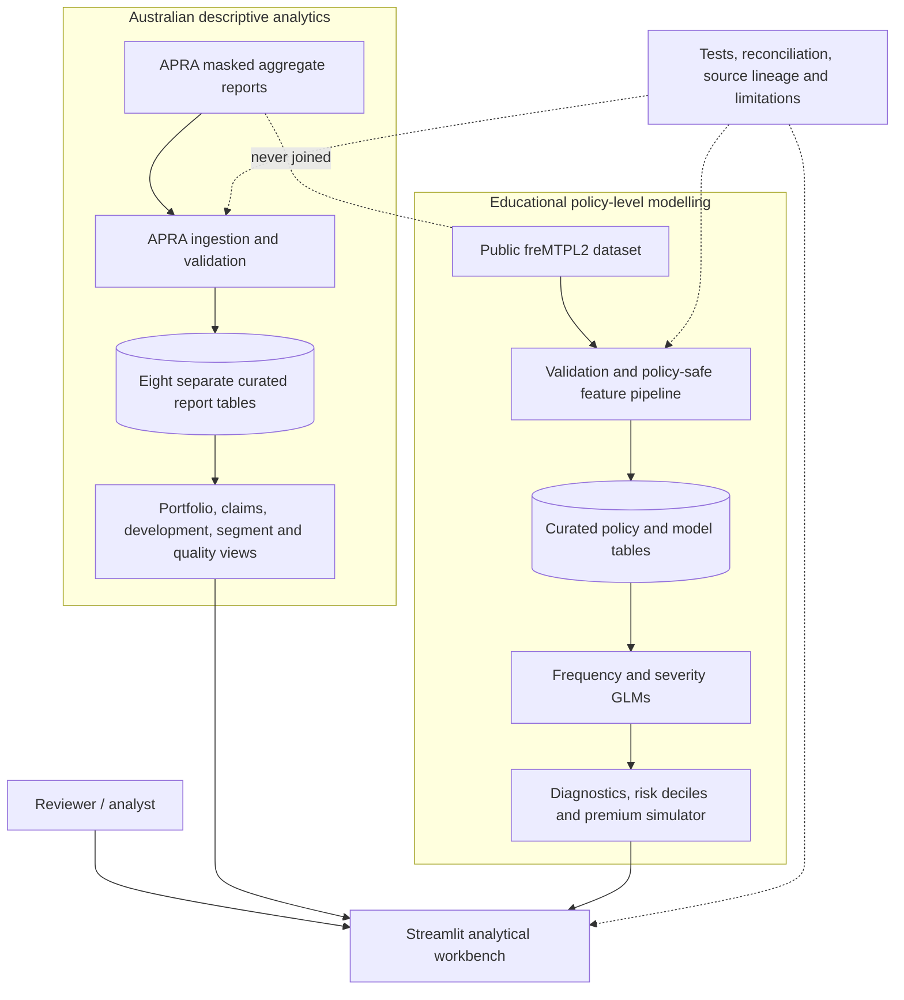
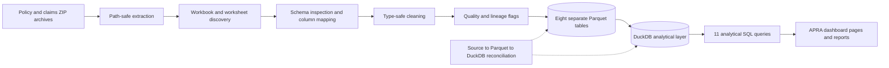
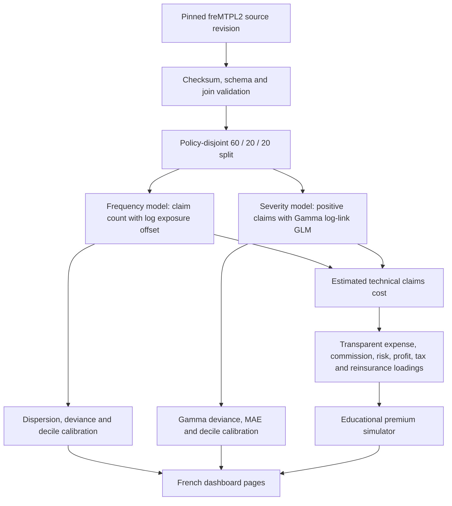
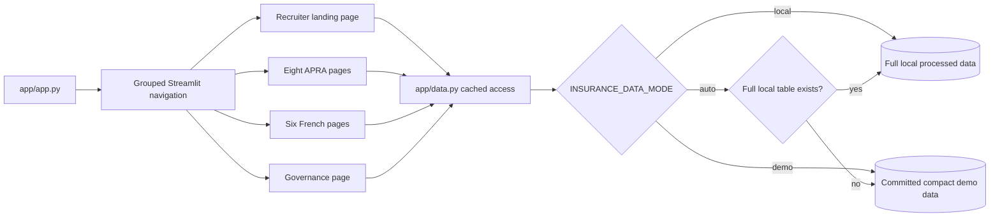
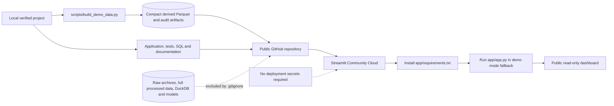
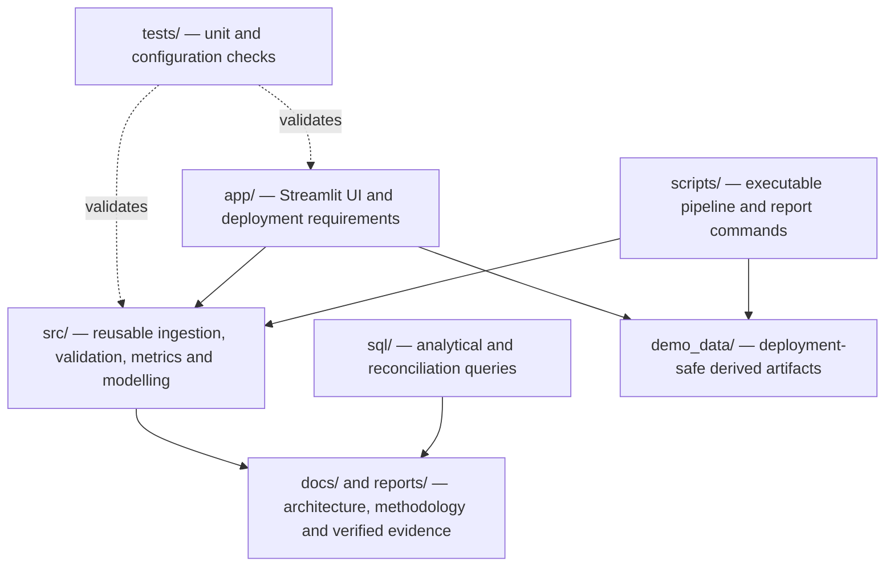

# Architecture guide

This guide explains how data moves through the project, why the Australian and French modules stay
separate, how the application chooses data at runtime, and how the public deployment is assembled.

## 1. System context

The APRA reports provide Australian context at an aggregate grain. freMTPL2 provides policy-level
records suitable for an educational modelling demonstration. No feature, row, metric or model is
transferred between the two modules.

## 2. APRA data engineering flow

State, occupation, excess and limit-of-indemnity reports are overlapping alternate cuts. They are
stored and analysed separately to prevent double counting.

## 3. French modelling flow

Policy ID is used only for validated joins and split membership. It is excluded from every model
formula.

## 4. Streamlit application structure

`auto` is the default. It gives analysts full fidelity after running the pipelines and makes a clean
GitHub checkout immediately usable with the compact public artifacts.

## 5. Public deployment architecture

Only compact derived artifacts are committed. Raw archives, full processed datasets, the local
DuckDB file and fitted model binaries remain outside Git.

## 6. Repository component map

## Diagram sources

The original Mermaid sources are stored alongside this guide:

- [`architecture-overview.mmd`](architecture-overview.mmd)
- [`apra-data-flow.mmd`](apra-data-flow.mmd)
- [`french-model-pipeline.mmd`](french-model-pipeline.mmd)
- [`application-runtime.mmd`](application-runtime.mmd)
- [`deployment-architecture.mmd`](deployment-architecture.mmd)

Run `python scripts/generate_diagrams.py` to render SVG copies when Mermaid CLI is available.
