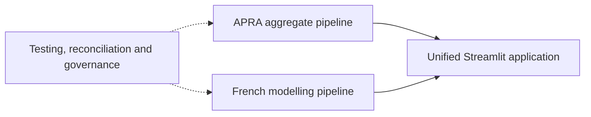

# Architecture

The project deliberately contains two separate pipelines. APRA masked aggregate reports support
Australian descriptive portfolio analytics. The public French freMTPL2 dataset supports
educational policy-level modelling. No row, feature, metric or model crosses between them.

## Overview

The full diagrams are stored as Mermaid source files in this directory. Run
`python scripts/generate_diagrams.py` to render SVG files when Mermaid CLI is available.

